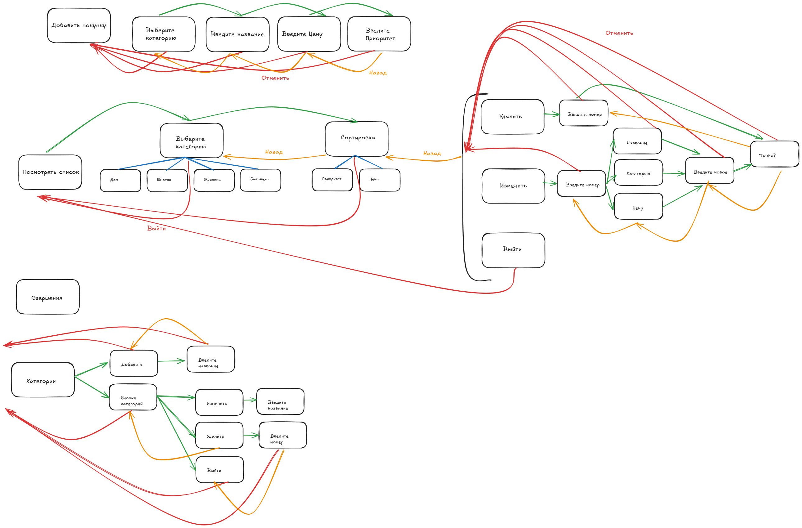

# wifesListBot

## Цель 💡
Разработка телеграмм бота с не простой логикой. Интеграция с Postgresql, возможно ещё будет Redis. Организовано логирование, мидлвари и обеспечен одновременный доступ к боту с нескольких аккаунтов.

## Состояние проекта
В разработке. 🚀


## Структура проекта 📁
```md
├── 📄main.go - основное приложение
├── 📁 configs
    ├── 📄config.go - функционал для загрузки системных переменных из .env файла
├── 📁 internal - внутренний код для реализации работы со статистикой, юзером, и ссылками
    ├── 📁 shop - модуль покупок
├── 📁 migrations - миграции для БД
├── 📁 pkg - Код переиспользуемых библиотек(logger, работа с БД, DI, eventBus, jwt, middleware, request, response)
├── 📄 LICENSE
```
## Описание взаимодействия с ботом


## Реализованный функционал 📊
В проекте реализованы сложные диалоги с пользователем с использованием FSM(Finite State Machine). CRUD для работы со списком покупок, списком категорий. Авторизация и аутентификация пользователя. Middleware авторизации на основе решений телеграмма, Логгирование. База данных - Postgresql, используемая и разворачиваемая черезе docker-compose. Работа с бд через ORM. Миграции. CMD для генерации секретного ключа. Dependencie Inversion, паттерн репозиторий. Шина событий. e2e и unit тесты.

## Дальнейшее развитие проекта 🌱
Из идей - посмотреть как реализуется простейший HTML5 и JS в телеграмме.

## Конфигурация ⚙️
1. Получаем бот токен и записываем в .env файл
```
BOT_TOKEN=<ваш токен>
```
2. Конфигурация БД
В .env файле записываем 
```
POSTGRES_USER="ваш_юзер"
POSTGRES_PASSWORD="ваш_пароль"
```
Меняем DSN в .env файле
```
DSN="host=localhost user=<POSTGRES_USER> password=<POSTGRES_PASSWORD> dbname=list port=5431 sslmode=disable"
```

База данных разворачивается через докер командой

```cmd
docker-compose up -d --build
```

3. Наполнение БД

Сначала подключаемся к бд любым удобным сопособом. Создаём базу данных, с котором будем работать, в моём случае это list
```sql
CREATE DATABASE list;
```
Выполняем миграции в БД
```cmd
CREATE DATABASE list;
```

## Запуск проекта 🧪
В корне проекта запускаем main файл
```cmd
go run main.go
```

