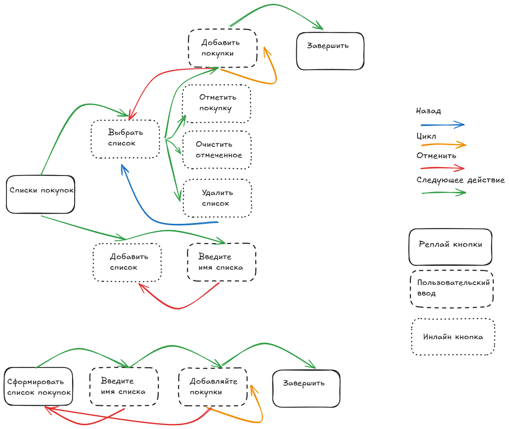

# wifesListBot

## Цель 💡
Разработка телеграмм бота с не простой логикой. Интеграция с Postgresql, возможно ещё будет Redis. Организовано логирование, мидлвари и обеспечен одновременный доступ к боту с нескольких аккаунтов.

## Состояние проекта
В разработке. 🚀


## Структура проекта 📁
```md
├── 📄main.go - основное приложение
├── 📁 configs
    ├── 📄config.go - функционал для загрузки системных переменных из .env файла
├── 📁 internal - внутренний код для реализации работы со статистикой, юзером, и ссылками
    ├── 📁 shop - модуль покупок
├── 📁 migrations - миграции для БД
├── 📁 pkg - Код переиспользуемых библиотек(logger, работа с БД, DI, eventBus, jwt, middleware, request, response)
├── 📄 LICENSE
```
## Описание взаимодействия с ботом


## Реализованный функционал 📊
В проекте реализованы сложные диалоги с пользователем с использованием FSM(Finite State Machine). CRUD для работы со списком покупок, списком категорий. Авторизация и аутентификация пользователя. Middleware авторизации на основе решений телеграмма, Логгирование. База данных - Postgresql, используемая и разворачиваемая черезе docker-compose. Работа с бд через ORM. Миграции. CMD для генерации секретного ключа. Dependencie Inversion, паттерн репозиторий. Шина событий. e2e и unit тесты.

## Дальнейшее развитие проекта 🌱
Из идей - посмотреть как реулизуется простейший HTML5 и JS в телеграмме.

## Запуск проекта 🧪
Раздел в разработке...

